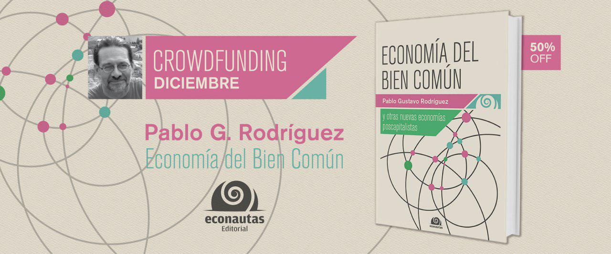

# Conversatorio sobre Monedas Sociales

#### Dr. Pablo Gustavo Rodriguez
- Director de la Cátedra Libre de Nuevas Economías (UNLP)
- Lic. en Antropología (UNLP) y Dr. en Ciencias Sociales (UNLP)
- Autor del libro "Economía del Bien Común y otras nuevas economías poscapitalistas"

> Pablo es un promotor de las nuevas economías solidarias, colaborativas, circulares, p2p, las monedas sociales, el decrecimiento, la transición, el software libre y el florecimiento de las personas y los ecosistemas.

#### Temas a desarrollar (1 hr)

* Qué es la riqueza
* Qué es el dinero
* Funciones del dinero
* Quién y cómo se crea el dinero
* Mitos del dinero
* Breve historia del dinero
* Problemas del dinero-deuda
* Monedas sociales y complementarias
* Tipos de monedas según diferentes criterios. Ejemplos
* Criptomonedas. Bitcoin, FairCoin y MonedaPar. Diferencias. Cómo usarlas

#### Juego (1 hr)

* Vamos a jugar al *"juego del intercambio"*

### Lugar: Vagón de las flores (Andino), Río Cuarto.
### Fecha y hr: Viernes 6 de Dic, 20h

### Economía del Bien Común y otras nuevas economías poscapitalistas

[Campaña de crowdfunding del libro "Economía del bien común y otras nuevas economías poscapitalistas"](https://econautaseditorial.com/productos/economia-del-bien-comun/)

#### Referencias:

- [Economía del Bien Común y otras nuevas economías poscapitalistas](https://econautaseditorial.com/productos/economia-del-bien-comun/)
- [Cátedra Libre de Nuevas Economías, Universidad Nacional de La Plata](https://clineunlp.wordpress.com)
- [FairCoin](https://fair-coin.org/es)
- [Moneda Par](https://www.monedapar.com.ar)
- [Un año de FairCoop en Argentina](https://clineunlp.wordpress.com/2019/01/02/un-ano-de-faircoop-en-argentina/)
- [El juego del intercambio, de Matthew Slater](https://gopacifia.org/el-juego-del-intercambio/)
